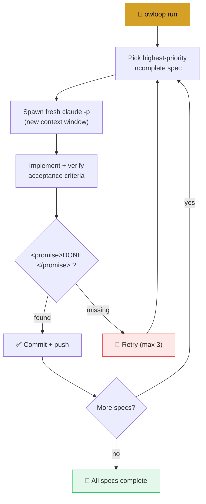

<div align="center">

# owloop

**Your code evolves while you sleep.**

A spec-driven autonomous coding loop for Claude Code.<br>
Each iteration: fresh context, one spec, verified completion, clean commit.

[Quick Start](#quick-start) · [How It Works](#how-it-works) · [Writing Specs](#writing-specs) · [Credits](#credits)

</div>

---

## Quick Start

```bash
# install from git
uv tool install git+https://github.com/caoergou/owloop

# then in your project:
owloop init
owloop run
```

*PyPI release coming soon — for now install from git.*

### Commands

| Command | Description |
|---|---|
| `owloop init` | Initialize owloop in current project (creates specs/, templates) |
| `owloop run` | Start the autonomous loop with TUI |
| `owloop plan` | Generate implementation plan from specs |
| `owloop status` | Show specs and completion progress |
| `owloop version` | Show the installed owloop version |
| `owloop new-spec` | Interactive spec creation wizard *(coming soon)* |

## How It Works



**Key properties:**

- **Fresh context every iteration** — each loop spawns a new `claude -p` process. No context overflow, no degradation.
- **State lives on disk** — `specs/`, `IMPLEMENTATION_PLAN.md`, and logs. Nothing in memory.
- **Stuck detection** — 3 consecutive failures without `<promise>DONE</promise>` triggers a warning and resets.
- **Auto Mode** — uses `--permission-mode auto` instead of `--dangerously-skip-permissions`. Same autonomy, proper safety boundaries.
- **Worktree isolation** — runs in a separate `git worktree`, your main checkout is never touched.

## Writing Specs

owloop specs are **constraint-oriented**: define what's off-limits, then make every acceptance criterion a shell command.

```markdown
# Spec: Extract ValidationError Handling

## Priority: 1

## Requirements
- Extract ~69 repeated `except ValidationError` blocks into
  a single Flask `@app.errorhandler(ValidationError)`
- Register it in the app factory

## Acceptance Criteria
- [ ] grep -c "except ValidationError" backend/app/api/*.py  →  ≤ 5
- [ ] uv run ruff check backend/  →  0 errors
- [ ] grep -c "errorhandler" backend/app/__init__.py  →  ≥ 1

## Exclusions
- Do NOT change API response formats (status codes, JSON shape)
- Do NOT modify exception handling for anything other than ValidationError
- Do NOT touch models/, schemas/, services/, pyproject.toml, uv.lock

## Verification
After each file: uv run ruff check backend/  →  commit only if clean

Output when complete: `<promise>DONE</promise>`
```

**Why this format works:**
- `Exclusions` prevent the agent from drifting into unrelated "improvements"
- `Acceptance Criteria` with shell commands give `grep` something to verify — no AI judgment needed
- One spec = one concern. Don't combine unrelated changes.

## Differences from Upstream

owloop is forked from [fstandhartinger/ralph-wiggum](https://github.com/fstandhartinger/ralph-wiggum). What changed:

| | upstream | owloop |
|---|---|---|
| Permission model | `--dangerously-skip-permissions` | `--permission-mode auto` |
| Repo safety | Runs on your checkout directly | Worktree isolation |
| Spec format | Requirements + manual checklists | Constraint-oriented (Exclusions + shell-verifiable criteria) |
| Run report | Terminal + logs | Lavish HTML report *(coming soon)* |

Everything else — fresh context per loop, stuck detection, circuit breaker, Telegram notifications, Codex/Gemini/Copilot variants — carries over unchanged.

## Credits

Built on [Geoffrey Huntley's Ralph Wiggum methodology](https://ghuntley.com/ralph/), forked from [Florian Standhartinger's implementation](https://github.com/fstandhartinger/ralph-wiggum).

## License

[MIT](LICENSE)
