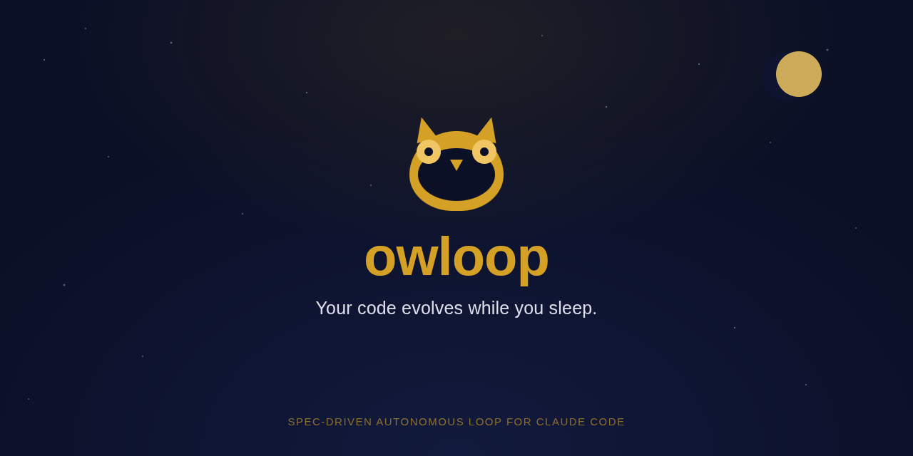
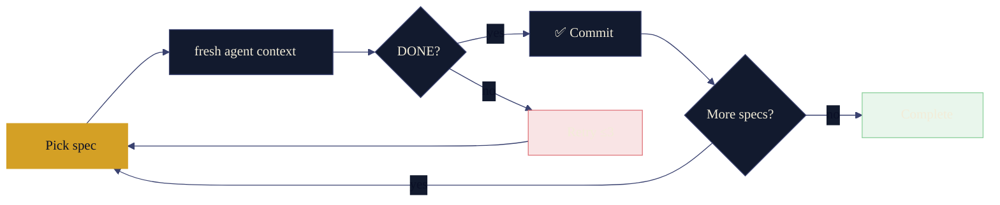

<div align="center">



<br>

[](LICENSE)
[](https://python.org)
[](https://github.com/caoergou/owloop/actions/workflows/ci.yml)
[](https://agentskills.io)
[](https://eric.run.place/owloop/)

*Your code evolves while you sleep.*

**Write specs. Start the loop. Wake up to clean commits.**

> 🦉 Ollie is a nocturnal owl.
>
> While you sleep, he reads your specs, spawns a fresh agent iteration for each task,
> verifies the result with real shell commands, and only commits when they pass.

[Quick Start](#-quick-start) · [How It Works](#-how-it-works) · [Writing Specs](#-writing-specs) · [Compared To](#-compared-to) · [FAQ](#-faq)

</div>

---

> You have 20 lint categories to fix, 200 functions missing type annotations, and error handling copy-pasted everywhere. You know what to do — you just don't have the hours. **owloop does it while you sleep.**

```
owloop run → pick spec → fresh claude -p → verify with shell commands → commit → next spec → 🌅
```

## 🌙 Quick Start

```bash
# Install from PyPI
uv tool install owloop
# or: pip install owloop

owloop init        # creates specs/ and templates
# edit specs/01-example.md with your task
owloop run         # start the loop
```

<details>
<summary><strong>All commands</strong></summary>

| Command | Description |
|---|---|
| `owloop init` | Initialize project (creates `specs/`, `.gitignore` entries) |
| `owloop run` | Start the autonomous loop with TUI |
| `owloop run -n 20` | Limit to 20 iterations |
| `owloop run --max-duration 120` | Stop after 2 hours |
| `owloop run --idle-timeout 1800` | Kill hung agent after 30min silence |
| `owloop plan` | Generate implementation plan from specs |
| `owloop status` | Show specs and completion progress |
| `owloop version` | Show installed version |

**Global options**

| Option | Description |
|---|---|
| `--ascii` | Use ASCII art instead of Unicode glyphs (better on older Windows terminals) |
| `--no-color` | Disable colored terminal output |
| `--compact` | Force the compact single-column TUI layout |

</details>

## 🦉 How It Works



| Property | How |
|---|---|
| **Fresh context** | Each iteration starts a brand-new agent process. No context rot. |
| **Deterministic completion** | `grep` for `<promise>DONE</promise>` — no AI judgment, no surprises. |
| **Worktree isolation** | Runs in a separate `git worktree`. Your main checkout stays untouched. |
| **Auto Mode** | `--permission-mode auto`: Ollie asks before risky moves, never YOLO. |
| **Stuck detection** | 3 consecutive failures → warning and a reset. |
| **Fix-loop detection** | Same files modified 3+ rounds → Ollie warns of a death spiral. |
| **Duration cap** | `--max-duration` keeps overnight runs from wandering too long. |

## 📝 Writing Specs

Specs are **constraint-oriented**: define what's off-limits, then make every acceptance criterion a shell command.

```markdown
# Spec: Extract ValidationError Handling

## Priority: 1

## Requirements
- Extract ~69 repeated `except ValidationError` blocks into
  a single Flask `@app.errorhandler(ValidationError)`

## Acceptance Criteria
- [ ] grep -c "except ValidationError" backend/app/api/*.py  →  ≤ 5
- [ ] uv run ruff check backend/  →  0 errors
- [ ] grep -c "errorhandler" backend/app/__init__.py  →  ≥ 1

## Exclusions
- Do NOT change API response formats
- Do NOT touch models/, schemas/, services/

## Verification
After each change: uv run ruff check backend/

Output when complete: `<promise>DONE</promise>`
```

> **Why this works:** `Exclusions` prevent drift. Shell commands verify "done" — no AI judgment needed. One spec = one concern.

<details>
<summary><strong>Rule of thumb</strong></summary>

If you can write a shell command that verifies "done", it's a good owloop task. If "done" requires a human to look and decide, it's not.

**Best fit:** lint fixes, type annotations, dead code removal, DRY extraction, import cleanup<br>
**Poor fit:** feature design, architecture decisions, UI/UX, security-sensitive changes

</details>

## 🔄 Compared To

| | owloop | `/goal` | [gnhf](https://github.com/kunchenguid/gnhf) |
|---|---|---|---|
| **Completion** | grep (deterministic) | Haiku model (probabilistic) | grep |
| **Context** | Fresh per iteration | Same session | Fresh per iteration |
| **Specs** | Constraint-oriented | Free-form | Free-form |
| **Best for** | Backlog of verifiable tasks | One focused task | Multi-agent overnight |

## ❓ FAQ

<details>
<summary><strong>When should I use owloop instead of <code>/goal</code>?</strong></summary>

`/goal` is great for one task in one sitting. owloop is for backlogs — a queue of specs, each run in a fresh context, unattended overnight. If you're clearing twenty lint categories or migrating a whole module, loop engineering scales further than one long session.

</details>

<details>
<summary><strong>Is this safe to run on production code?</strong></summary>

owloop runs in a separate `git worktree` with `--permission-mode auto`. Your main branch stays clean. That said, treat every overnight run as a PR to review in the morning, not a deploy.

</details>

<details>
<summary><strong>Can I use owloop with Codex or OpenCode?</strong></summary>

Not directly — owloop is built around `claude -p`. For multi-agent support, [gnhf](https://github.com/kunchenguid/gnhf) is the better fit.

</details>

## 🛠️ Development

owloop uses `uv` for dependency management and ships with `ruff`, `mypy`, and `pytest-cov` as dev tools.

```bash
uv sync --group dev          # install dev dependencies
uv run pytest -q             # run tests with coverage
uv run ruff check src/owloop tests
uv run mypy src/owloop tests
```

All changes are validated on Linux, macOS, and Windows via GitHub Actions.

## 🦉 Brand

owloop's identity — Ollie the owl, the night/amber palette, and the "your code evolves while you sleep" story — is documented in [.github/BRAND.md](.github/BRAND.md).

## Credits

Built on [Geoffrey Huntley's Ralph Wiggum methodology](https://ghuntley.com/ralph/), forked from [Florian Standhartinger's implementation](https://github.com/fstandhartinger/ralph-wiggum).

## License

[MIT](LICENSE)
