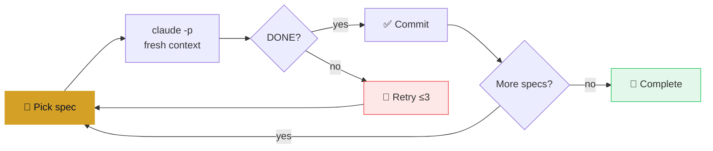

<div align="center">

# owloop

**Your code evolves while you sleep.**

A spec-driven autonomous coding loop for Claude Code.<br>
Each iteration: fresh context, one spec, verified completion, clean commit.

[Quick Start](#quick-start) · [How It Works](#how-it-works) · [Writing Specs](#writing-specs) · [FAQ](#faq) · [Credits](#credits)

</div>

---

You have a codebase full of lint warnings, missing type annotations, and copy-pasted error handling — the kind of cleanup that always loses to shipping features. owloop is a spec-driven, autonomous loop engineering tool for Claude Code: turn that backlog into constraint-oriented specs, run `owloop run`, and go to sleep. Each iteration spawns a fresh `claude -p` process against exactly one spec, verifies its acceptance criteria with real shell commands, and commits only when they pass. Wake up to a clean commit history, not a burned overnight run you have to babysit.

## Quick Start

```bash
# install from git
uv tool install git+https://github.com/caoergou/owloop

# then in your project:
owloop init
owloop run
```

*PyPI release coming soon — for now install from git.*

### Commands

| Command | Description |
|---|---|
| `owloop init` | Initialize owloop in current project (creates specs/, templates) |
| `owloop run` | Start the autonomous loop with TUI |
| `owloop plan` | Generate implementation plan from specs |
| `owloop status` | Show specs and completion progress |
| `owloop version` | Show the installed owloop version |
| `owloop new-spec` | Interactive spec creation wizard *(coming soon)* |

## How It Works



**Key properties:**

- **Fresh context every iteration** — each loop spawns a new `claude -p` process. No context overflow, no degradation.
- **State lives on disk** — `specs/`, `IMPLEMENTATION_PLAN.md`, and logs. Nothing in memory.
- **Stuck detection** — 3 consecutive failures without `<promise>DONE</promise>` triggers a warning and resets.
- **Auto Mode** — uses `--permission-mode auto` instead of `--dangerously-skip-permissions`. Same autonomy, proper safety boundaries.
- **Worktree isolation** — runs in a separate `git worktree`, your main checkout is never touched.

## Writing Specs

owloop specs are **constraint-oriented**: define what's off-limits, then make every acceptance criterion a shell command.

```markdown
# Spec: Extract ValidationError Handling

## Priority: 1

## Requirements
- Extract ~69 repeated `except ValidationError` blocks into
  a single Flask `@app.errorhandler(ValidationError)`
- Register it in the app factory

## Acceptance Criteria
- [ ] grep -c "except ValidationError" backend/app/api/*.py  →  ≤ 5
- [ ] uv run ruff check backend/  →  0 errors
- [ ] grep -c "errorhandler" backend/app/__init__.py  →  ≥ 1

## Exclusions
- Do NOT change API response formats (status codes, JSON shape)
- Do NOT modify exception handling for anything other than ValidationError
- Do NOT touch models/, schemas/, services/, pyproject.toml, uv.lock

## Verification
After each file: uv run ruff check backend/  →  commit only if clean

Output when complete: `<promise>DONE</promise>`
```

**Why this format works:**
- `Exclusions` prevent the agent from drifting into unrelated "improvements"
- `Acceptance Criteria` with shell commands give `grep` something to verify — no AI judgment needed
- One spec = one concern. Don't combine unrelated changes.

## Differences from Upstream

owloop is forked from [fstandhartinger/ralph-wiggum](https://github.com/fstandhartinger/ralph-wiggum). What changed:

| | upstream | owloop |
|---|---|---|
| Permission model | `--dangerously-skip-permissions` | `--permission-mode auto` |
| Repo safety | Runs on your checkout directly | Worktree isolation |
| Spec format | Requirements + manual checklists | Constraint-oriented (Exclusions + shell-verifiable criteria) |
| Run report | Terminal + logs | Lavish HTML report *(coming soon)* |

Everything else — fresh context per loop, stuck detection, circuit breaker, Telegram notifications, Codex/Gemini/Copilot variants — carries over unchanged.

### Compared to other loop tools

| Tool | Approach | Best for |
|---|---|---|
| **owloop** | Spec-driven loop engineering with worktree isolation, built for Claude Code | A backlog of well-defined, independently verifiable tasks |
| **[gnhf](https://github.com/kunchenguid/gnhf)** | Agent-agnostic "ralph"-style orchestrator (Claude Code, Codex, Rovo Dev, OpenCode, Copilot CLI, Pi), shared `notes.md` memory across iterations | Multi-agent overnight runs where you want to mix CLIs |
| **`/goal`** | Built into Claude Code — a single session runs turn-by-turn until a small model judges your completion condition met | One focused task, same sitting, no extra tool to install |
| **[roborev](https://roborev.io/)** | Continuous background review of every commit — not a loop driver | Catching issues in agent-written commits after the fact; pairs with any of the above |

## FAQ

**When should I use owloop instead of `/goal`?**
`/goal` is a Claude Code built-in: one session keeps working turn-by-turn until a small model decides your completion condition is met. It's a great fit for one task in one sitting. owloop is for backlogs — a queue of specs, each run in a fresh context, unattended for hours or overnight. If you're clearing twenty lint categories or migrating a whole module, loop engineering with independent shell-verified acceptance criteria scales further than one long session judged by a model.

**How is owloop different from gnhf?**
Both keep an agent committing while you sleep. gnhf is agent-agnostic and syncs state across iterations via a shared `notes.md`. owloop is Claude-Code-specific and specs-first: every unit of work is a constraint-oriented spec file with explicit Exclusions and shell-verifiable Acceptance Criteria, so "done" is decided by a command you wrote, not the agent's own narrative. owloop also defaults to worktree isolation, so your checkout is never touched mid-run.

**Can I use owloop with Codex or OpenCode?**
Not directly — owloop is built around `claude -p`. This repo also carries the upstream Ralph Wiggum script variants (`ralph-loop*.sh`) for Codex/Gemini/Copilot compatibility; if you need first-class multi-agent support, gnhf is the better fit.

**Is this safe to run on production code?**
owloop never touches your working checkout directly — it runs in a separate `git worktree`, and uses `--permission-mode auto` rather than `--dangerously-skip-permissions`, so tool calls still respect Claude Code's permission boundaries. That said, "safe" means "your main branch stays clean and reviewable," not "unsupervised on production infrastructure." Treat every overnight run as a PR to review in the morning, not a deploy.

## Credits

Built on [Geoffrey Huntley's Ralph Wiggum methodology](https://ghuntley.com/ralph/), forked from [Florian Standhartinger's implementation](https://github.com/fstandhartinger/ralph-wiggum).

## License

[MIT](LICENSE)
