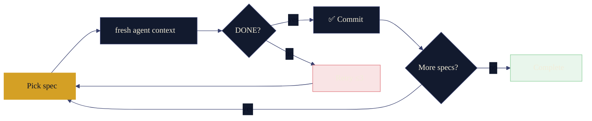

<div align="center">


<br>

[](https://pypi.org/project/owloop/)
[](LICENSE)
[](https://python.org)
[](https://github.com/caoergou/owloop/actions/workflows/ci.yml)
[](https://eric.run.place/owloop/)

*Your code evolves while you sleep.*

</div>

---

owloop is a **spec-driven autonomous coding loop** for Claude Code, Kimi Code CLI, Codex, Cursor, and other CLI-based coding agents. You write specs, start the loop, and wake up to clean commits.

Each iteration spawns a **fresh agent** with zero accumulated context, verifies every acceptance criterion with **real shell commands**, and only commits when they pass.

```
owloop run → pick spec → fresh agent → verify with shell → commit → next spec → 🌅
```

## Quick Start

```bash
uv tool install owloop        # or: pip install owloop

owloop go "refactor error handling"   # one command: init → spec → review → run
```

That's it. owloop auto-initializes, scans your codebase, generates spec(s), asks for approval, and starts the loop.

## Persistent defaults

Tired of repeating the same flags? Put them in `.owloop/config.toml` under `[run]`:

```toml
[run]
model = "claude-sonnet-4"
max_iterations = 20
max_tokens = 200000
max_duration = 3600
workers = 2
notify_desktop = true
keep_retrying = false
```

Supported keys: `model`, `notify_desktop`, `converge`, `workers`, `rollback`, `max_iterations`, `max_duration`, `max_tokens`, `idle_timeout`, `max_tokens_per_iteration`, `max_turns_per_iteration`, `keep_retrying`, `notify_webhook`, `no_tui`, `dry_run`.

CLI flags always win: an explicit `--max-iterations 5` overrides the config file.

## Install as an Agent Skill

Owloop also ships as a set of composable agent skills for any agentskills.io-compatible agent:

```bash
# Claude Code
npx skills add caoergou/owloop --agent claude-code

# Kimi Code CLI / Codex / Cursor / etc.
npx skills add caoergou/owloop --agent '*'
```

Skills included:

| Skill | Purpose |
|---|---|
| `owloop` | Core loop engineering methodology |
| `owloop-spec` | Interactive spec-creation wizard |
| `owloop-loop-control` | Promise protocol (DONE/BLOCKED/DECIDE) and stuck behavior |
| `owloop-verify` | Baseline calibration and verification pipeline design |

<details>
<summary><strong>All commands</strong></summary>

| Command | Description |
|---|---|
| `owloop go "goal"` | **One command flow**: init → generate spec(s) → review → start loop |
| `owloop spec "goal"` | Generate spec(s) only (also auto-inits) |
| `owloop run` | Start the loop on existing specs |
| `owloop agents` | List coding-agent presets and their readiness |
| `owloop run --agent codex` | Run the loop on a different coding agent |
| `owloop run -n 20` | Limit to 20 iterations |
| `owloop run --max-tokens 200000` | Stop after token budget reached |
| `owloop run --no-tui` / `--plain` | Print plain console output instead of the full-screen TUI |
| `owloop check` | Validate all specs (pre-flight linter) |
| `owloop status` | Show specs, completion progress, and the latest session/runtime summary |
| `owloop finish` | Show the latest session and optionally merge, push, and clean up |
| `owloop logs` | Inspect per-iteration logs, events, and discarded patches |
| `owloop report` | Generate AI-powered HTML summary report |
| `owloop -v go "goal"` | Verbose mode: show all agent output with timestamps |
| `owloop report --no-ai` | Generate fast, offline report |
| `owloop spec-from-issue 42` | Generate a spec from a GitHub issue |
| `owloop version` | Show installed version |

</details>

## How It Works



| Property | How |
|---|---|
| **Fresh context** | Each iteration is a brand-new agent process. No context rot. |
| **Deterministic completion** | `grep` for `<promise>DONE</promise>` — no AI judgment needed. |
| **Worktree isolation** | Runs in a separate `git worktree`. Your main checkout stays untouched. |
| **Auto Mode** | Uses your agent's auto-permission mode. Never YOLO. |
| **Token budget cap** | `--max-tokens` stops the run before costs spiral. |
| **AI reports** | `owloop report` produces a reviewable HTML artifact after each run. |

## Supported coding agents

owloop drives agents two ways: **native adapters** for Claude Code and Kimi Code CLI, and one **[ACP](https://agentclientprotocol.com) adapter** (Agent Client Protocol — JSON-RPC over stdio) for everything else. Run `owloop agents` to see what's ready on your machine, then `owloop run --agent <name>`.

| Agent | Preset | Path | Setup |
|---|---|---|---|
| Claude Code | `claude` (default) | native | `claude` CLI logged in |
| Kimi Code CLI | `kimi` | native | `kimi` CLI, `default_permission_mode: auto` |
| Claude Code | `claude-acp` | ACP | Node (`npx @agentclientprotocol/claude-agent-acp`) |
| OpenAI Codex | `codex` | ACP | Node (`npx @agentclientprotocol/codex-acp`) |
| OpenCode | `opencode` | ACP | `opencode` CLI |
| Qoder CLI | `qoder` | ACP | `qodercli` + `QODER_PERSONAL_ACCESS_TOKEN` |
| Kiro CLI | `kiro` | ACP | `kiro-cli` |
| Gemini CLI | `gemini` | ACP | Node (`npx @google/gemini-cli`) |
| Qwen Code | `qwen` | ACP | Node (`npx @qwen-code/qwen-code`) |
| GLM (Z.ai) | `glm` | ACP via Anthropic-compatible endpoint | `export ZAI_API_KEY=...` |
| DeepSeek | `deepseek` | ACP via Anthropic-compatible endpoint | `export DEEPSEEK_API_KEY=...` |

GLM and DeepSeek ship no standalone agent CLI; their officially documented path is an Anthropic-compatible endpoint, so owloop launches the Claude ACP adapter with `ANTHROPIC_BASE_URL` pointed at the vendor (GLM mainland users: override the URL to `https://open.bigmodel.cn/api/anthropic` in a custom preset).

ACP presets other than the ones we test against are marked *experimental* in `owloop agents` — they follow the official [ACP registry](https://github.com/agentclientprotocol/registry) launch commands but haven't been validated end-to-end yet. Add your own agents in `.owloop/agents.toml`:

```toml
[agents.mytool]
cmd = ["mytool", "acp"]
env = { MYTOOL_API_KEY = "${MYTOOL_API_KEY}" }
default_model = "mytool-large"
```

Permissions on the ACP path are answered by owloop itself, one request at a time (`allow_once`) — agents are never launched in a bypass/YOLO mode.

<details>
<summary><strong>More features</strong></summary>

- **Cross-iteration notes** — `run-notes.md` carries learnings between iterations.
- **Fix-loop detection** — same files modified 3+ rounds triggers a death-spiral warning.
- **Sleep prevention** — keeps your machine awake during overnight runs (macOS / Linux / Windows).
- **Pre-flight linting** — `owloop check` validates specs before the loop starts.

</details>

## Specs

Specs are **constraint-oriented**: define what to do, what's off-limits, and make every acceptance criterion a shell command.

```markdown
# Spec: Extract ValidationError Handling

## Priority: 1

## Requirements
- Extract repeated `except ValidationError` blocks into a single `@app.errorhandler`

## Acceptance Criteria
- [ ] grep -c "except ValidationError" backend/app/api/*.py  →  ≤ 5
- [ ] uv run ruff check backend/  →  0 errors

## Exclusions
- Do NOT change API response formats
- Do NOT touch models/, schemas/, services/
```

> If you can write a shell command that verifies "done", it's a good owloop task.
> If "done" requires a human to look and decide, it's not.

## Compared To

| | owloop | Claude Code `/goal` |
|---|---|---|
| **Completion signal** | `grep` (deterministic) | Haiku model (probabilistic) |
| **Context** | Fresh per iteration | Same session |
| **Specs** | Constraint-oriented | Free-form |
| **Best for** | Backlog of verifiable tasks | One focused task |

## FAQ

<details>
<summary><strong>When should I use owloop instead of <code>/goal</code>?</strong></summary>

`/goal` is great for one task in one sitting. owloop is for backlogs — a queue of specs, each run in a fresh context, unattended overnight. If you're clearing twenty lint categories or migrating a whole module, owloop scales further than one long session.

</details>

<details>
<summary><strong>Is this safe to run on production code?</strong></summary>

owloop runs in a separate `git worktree` with your agent's auto-permission mode. Your main branch stays clean. Treat every overnight run as a PR to review in the morning, not a deploy.

</details>

## Development

```bash
uv sync --group dev          # install dev dependencies
uv run pytest -q             # run tests with coverage
uv run ruff check src/owloop tests
uv run mypy src/owloop tests
```

## Brand

owloop's identity — Ollie the owl, the night/amber palette, and the "your code evolves while you sleep" story — is documented in [.github/BRAND.md](.github/BRAND.md).

## Credits

Inspired by and built upon:

- [Geoffrey Huntley's Ralph Wiggum methodology](https://ghuntley.com/ralph/) — the original "unattended coding loop" concept
- [Florian Standhartinger's ralph-wiggum](https://github.com/fstandhartinger/ralph-wiggum) — the implementation owloop was forked from
- [gnhf](https://github.com/kunchenguid/gnhf) — multi-agent overnight runner, influenced owloop's fresh-context-per-iteration design

## License

[MIT](LICENSE)
